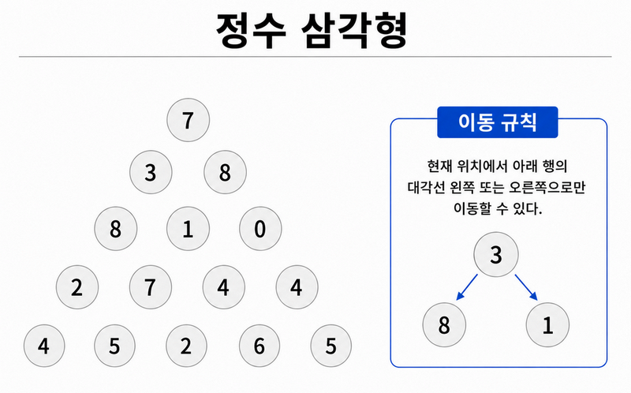

# 동적 계획법 - 정수 삼각형

## 1. 동적 계획법 개념

### 동적 계획법이란?

동적 계획법(Dynamic Programming, DP)은 **큰 문제를 여러 개의 작은 문제로 나누어 해결하고, 작은 문제의 결과를 저장하여 다시 사용하는 알고리즘 설계 방법**이다.

어떤 문제를 해결하는 과정에서는 같은 계산이 여러 번 반복될 수 있다. 이때 같은 값을 매번 처음부터 다시 계산하면 불필요한 연산이 많아진다.

동적 계획법에서는 한 번 계산한 결과를 배열이나 자료구조에 저장한다. 이후 같은 결과가 필요하면 다시 계산하지 않고 저장된 값을 사용하여 실행 시간을 줄인다.

> 동적 계획법의 핵심은 작은 문제의 결과를 저장하고 재사용하는 것이다.

### 간단한 예시

피보나치 수열은 앞의 두 수를 더하여 다음 수를 구한다.

```text
F(1) = 1
F(2) = 1
F(3) = F(2) + F(1) = 2
F(4) = F(3) + F(2) = 3
F(5) = F(4) + F(3) = 5
```

피보나치 수를 단순한 재귀 함수로 계산하면 `F(3)`, `F(2)`와 같은 값을 여러 번 계산하게 된다.

하지만 한 번 구한 값을 배열에 저장하면 같은 값을 반복해서 계산하지 않아도 된다.

```text
dp[1] = 1
dp[2] = 1
dp[3] = dp[2] + dp[1]
dp[4] = dp[3] + dp[2]
dp[5] = dp[4] + dp[3]
```

여기서 `dp[i]`는 `i`번째 피보나치 수를 의미한다.

### 동적 계획법의 적용 조건

모든 문제를 동적 계획법으로 해결할 수 있는 것은 아니다. 일반적으로 다음 두 가지 특징이 있는 문제에 동적 계획법을 적용할 수 있다.

#### 중복 부분 문제

**중복 부분 문제**란 큰 문제를 작은 문제로 나누었을 때, 같은 작은 문제가 여러 번 반복해서 나타나는 것을 의미한다.

예를 들어 `F(5)`를 재귀적으로 계산하면 다음과 같이 `F(3)`이 여러 번 필요하다.

```text
F(5)
├─ F(4)
│  ├─ F(3)
│  └─ F(2)
└─ F(3)
```

`F(3)`의 결과는 항상 같기 때문에 매번 다시 계산할 필요가 없다. 한 번 계산한 결과를 저장해 두면 다음부터는 저장된 값을 사용할 수 있다.

#### 최적 부분 구조

**최적 부분 구조**란 큰 문제의 가장 좋은 답을 작은 문제의 가장 좋은 답을 이용하여 구할 수 있는 성질을 의미한다.

즉, 작은 문제에서 구한 최적의 결과를 조합하여 전체 문제의 최적의 결과를 만들 수 있어야 한다.

예를 들어 어떤 위치까지 이동하는 최소 비용을 구하는 문제라면, 이전 위치까지의 최소 비용을 이용하여 현재 위치까지의 최소 비용을 계산할 수 있다.

### 동적 계획법 문제를 푸는 순서

동적 계획법 문제는 일반적으로 다음 순서로 접근한다.

1. 큰 문제를 작은 문제로 나눌 수 있는지 확인한다.
2. 같은 작은 문제가 반복되는지 확인한다.
3. 배열에 어떤 값을 저장할지 정한다.
4. 가장 처음에 필요한 초기값을 설정한다.
5. 이전 결과로 현재 값을 구하는 규칙인 점화식을 만든다.
6. 작은 문제부터 순서대로 계산한다.
7. 저장된 값에서 최종 정답을 구한다.

### 동적 계획법의 구현 방법

동적 계획법은 주로 메모이제이션과 타뷸레이션 방식으로 구현한다.

#### 메모이제이션

메모이제이션은 재귀 함수를 사용하여 필요한 값을 계산하고, 계산한 결과를 저장하는 방식이다.

이미 계산된 값이 있으면 같은 재귀 호출을 다시 실행하지 않고 저장된 값을 반환한다.

큰 문제에서 시작하여 필요한 작은 문제를 호출하는 형태이므로 **하향식 방식(Top-down)**이라고도 한다.

#### 타뷸레이션

타뷸레이션은 가장 작은 문제의 값부터 순서대로 계산하여 DP 테이블을 채우는 방식이다.

반복문을 사용하여 이미 계산된 값을 바탕으로 다음 값을 구하고, 최종 문제의 답까지 계산한다.

작은 문제에서 시작하여 더 큰 문제를 해결하는 형태이므로 **상향식 방식(Bottom-up)**이라고도 한다.

메모이제이션과 타뷸레이션은 계산 순서와 구현 방식은 다르지만, 계산한 결과를 저장하고 재사용한다는 점은 같다.

## 2. 정수 삼각형 문제

### 문제 링크

- [프로그래머스 - 정수 삼각형](https://school.programmers.co.kr/learn/courses/30/lessons/43105)

### 문제 설명



삼각형의 꼭대기에서 바닥까지 내려가는 경로 중, 거쳐 간 숫자의 합이 가장 큰 경우를 구한다.

아래 칸으로 이동할 때는 대각선 방향으로 한 칸 왼쪽 또는 오른쪽으로만 이동할 수 있다.

삼각형의 정보가 담긴 2차원 배열 `triangle`이 주어질 때, 거쳐 간 숫자 합의 최댓값을 반환하도록 `solution` 함수를 작성한다.

### 제한사항

- 삼각형의 높이는 1 이상 500 이하이다.
- 삼각형을 이루는 숫자는 0 이상 9,999 이하의 정수이다.

### 입출력 예

| triangle | result |
| --- | ---: |
| `[[7], [3, 8], [8, 1, 0], [2, 7, 4, 4], [4, 5, 2, 6, 5]]` | `30` |

## 3. 풀이 과정

### 동적 계획법이 필요한 이유

각 위치에서는 아래 행의 대각선 왼쪽 또는 오른쪽 중 한 칸으로 이동할 수 있다.

따라서 꼭대기에서 시작하여 이동할 수 있는 모든 경로를 확인하고, 각 경로의 합을 비교하는 완전탐색 방식으로도 문제를 해결할 수 있다.

하지만 삼각형의 높이가 `n`일 때 바닥까지 내려가려면 `n - 1`번 이동해야 하며, 이동할 때마다 두 방향 중 하나를 선택할 수 있다.

따라서 확인해야 하는 경로의 수는 대략 다음과 같이 증가한다.

```text
2^(n - 1)
```

문제에서 삼각형의 높이는 최대 500이므로 모든 경로를 직접 확인하는 방식은 매우 비효율적이다.

또한 여러 위치를 계산하는 과정에서 같은 아래쪽 위치의 결과가 반복해서 필요하다. 이 값을 매번 다시 계산하면 중복 연산이 발생한다.

따라서 각 위치에서 바닥까지 내려갔을 때의 최대 합을 한 번 계산하여 저장하고, 그 위의 위치를 계산할 때 저장된 값을 사용하는 동적 계획법을 적용한다.

### 계산 방향 결정

문제에서는 꼭대기에서 바닥으로 이동하지만, 이 풀이에서는 계산을 반대로 진행한다.

```text
맨 아래 행 → 꼭대기
```

아래에서 위로 계산하면 현재 위치에서 이동할 수 있는 왼쪽 아래와 오른쪽 아래의 두 값만 비교하면 된다.

반대로 위에서 아래로 계산하면서 `dp[i][j]`를 꼭대기부터 현재 위치까지의 최대 합으로 정의하면, 현재 위치에 따라 올 수 있는 칸의 수가 달라진다.

- 왼쪽 끝인 `j = 0`은 바로 위의 `dp[i - 1][0]`에서만 올 수 있다.
- 오른쪽 끝인 `j = i`는 왼쪽 위의 `dp[i - 1][i - 1]`에서만 올 수 있다.
- 가운데 칸은 `dp[i - 1][j - 1]`과 `dp[i - 1][j]` 두 곳에서 올 수 있다.

따라서 위에서 아래로 계산하면 양쪽 끝과 가운데를 나누어 처리해야 한다.

아래에서 위로 계산하면 모든 위치에서 왼쪽 아래와 오른쪽 아래의 두 값을 비교할 수 있으므로, 같은 계산식을 사용할 수 있다. 이러한 이유로 아래에서 위로 올라가는 방식을 선택하였다.

### DP 상태 정의

`dp[i][j]`는 다음과 같이 정의한다.

```text
dp[i][j]는 triangle[i][j]에서 시작하여
삼각형의 바닥까지 내려갔을 때 얻을 수 있는 최대 합이다.
```

예를 들어 `dp[2][0]`은 2행 0열에 있는 숫자 `8`에서 시작하여 바닥까지 내려갔을 때 얻을 수 있는 최대 합을 의미한다.

아래 행의 값이 먼저 계산되어 있으면 현재 위치의 값도 바로 계산할 수 있다.

예를 들어 아래쪽 두 위치의 값이 각각 `7`과 `12`로 계산되어 있다면, 현재 위치의 숫자 `8`에서는 더 큰 값인 `12`를 선택한다.

```text
dp[2][0] = 8 + max(7, 12) = 20
```

이처럼 이미 계산한 아래쪽 결과를 이용하여 그 위의 값을 차례대로 구한다.

### DP 테이블 생성

삼각형의 높이를 `n`이라고 하면 `n × n` 크기의 2차원 DP 테이블을 생성한다.

```cpp
int n = triangle.size();
vector<vector<int>> dp(n, vector<int>(n, 0));
```

삼각형은 행마다 사용하는 원소의 개수가 다르지만, 구현을 단순하게 하기 위해 정사각형 형태의 배열을 만들고 모든 값을 `0`으로 초기화한다.

### 초기값 설정

맨 아래 행에서는 더 이상 이동할 수 있는 위치가 없다.

따라서 맨 아래 행의 각 위치에서 바닥까지 내려갔을 때 얻을 수 있는 최대 합은 현재 위치의 숫자 자체이다.

```cpp
for (int i = 0; i < n; i++) {
    dp[n - 1][i] = triangle[n - 1][i];
}
```

예제의 마지막 행은 다음과 같다.

```text
4   5   2   6   5
```

따라서 DP 테이블의 마지막 행도 같은 값으로 초기화된다.

```text
dp[4] = 4   5   2   6   5
```

### 점화식

현재 위치가 `triangle[i][j]`일 때 이동할 수 있는 위치는 다음 두 곳이다.

```text
왼쪽 아래   : dp[i + 1][j]
오른쪽 아래 : dp[i + 1][j + 1]
```

두 위치에서 바닥까지 내려가는 최대 합 중 더 큰 값을 선택한 뒤, 현재 위치의 값을 더한다.

```text
dp[i][j]
= triangle[i][j]
+ max(dp[i + 1][j], dp[i + 1][j + 1])
```

코드에서는 다음과 같이 작성한다.

```cpp
dp[i][j] =
    max(dp[i + 1][j], dp[i + 1][j + 1])
    + triangle[i][j];
```

아래에서 위로 계산하면 모든 위치에서 같은 점화식을 사용할 수 있으므로 삼각형의 양쪽 끝을 별도로 처리할 필요가 없다.

### DP 테이블 채우기

맨 아래 행은 이미 초기화했으므로, 그 위의 행부터 꼭대기까지 올라가며 계산한다.

```cpp
for (int i = n - 2; i >= 0; i--) {
    for (int j = 0; j <= i; j++) {
        dp[i][j] =
            max(dp[i + 1][j], dp[i + 1][j + 1])
            + triangle[i][j];
    }
}
```

바깥쪽 반복문의 `i`는 아래에서 두 번째 행인 `n - 2`부터 꼭대기인 `0`까지 감소한다.

`i`행에는 `i + 1`개의 숫자가 있으므로, 안쪽 반복문의 `j`는 `0`부터 `i`까지 반복한다.

### 예제 계산 과정

주어진 삼각형은 다음과 같다.

```text
        7
      3   8
    8   1   0
  2   7   4   4
4   5   2   6   5
```

#### 1단계: 맨 아래 행 초기화

```text
4   5   2   6   5
```

#### 2단계: 네 번째 행 계산

각 위치의 숫자에 아래쪽 두 값 중 더 큰 값을 더한다.

```text
2 + max(4, 5) = 7
7 + max(5, 2) = 12
4 + max(2, 6) = 10
4 + max(6, 5) = 10
```

계산 결과는 다음과 같다.

```text
7   12   10   10
```

#### 3단계: 세 번째 행 계산

```text
8 + max(7, 12)  = 20
1 + max(12, 10) = 13
0 + max(10, 10) = 10
```

계산 결과는 다음과 같다.

```text
20   13   10
```

#### 4단계: 두 번째 행 계산

```text
3 + max(20, 13) = 23
8 + max(13, 10) = 21
```

계산 결과는 다음과 같다.

```text
23   21
```

#### 5단계: 꼭대기 계산

```text
7 + max(23, 21) = 30
```

따라서 꼭대기에 저장되는 값은 `30`이다.

### 최종 결과 구하기

`dp[0][0]`은 삼각형의 꼭대기에서 시작하여 바닥까지 내려갔을 때 얻을 수 있는 최대 합을 의미한다.

따라서 다음과 같이 `dp[0][0]`을 반환한다.

```cpp
return dp[0][0];
```

### 풀이 핵심 정리

이 문제는 모든 이동 경로를 직접 확인하지 않고, 각 위치에서 바닥까지 내려갔을 때 얻을 수 있는 최대 합을 DP 테이블에 저장하여 해결한다.

먼저 맨 아래 행을 원래 숫자로 초기화한다. 이후 아래에서 위로 올라가면서 현재 위치의 왼쪽 아래와 오른쪽 아래 값 중 더 큰 값을 선택하고 현재 위치의 숫자를 더한다.

이 과정을 꼭대기까지 반복하면 `dp[0][0]`에 전체 경로 중 가장 큰 합이 저장된다.

## 4. C++ 코드

```cpp
#include <iostream>
#include <vector>

using namespace std;

int solution(vector<vector<int>> triangle) {
    int n = triangle.size();

    // 각 위치에서 바닥까지 내려갔을 때 얻을 수 있는 최대 합을 저장한다.
    vector<vector<int>> dp(n, vector<int>(n, 0));

    // 맨 아래 행은 더 이상 이동할 수 없으므로 원래 값으로 초기화한다.
    for (int i = 0; i < n; i++) {
        dp[n - 1][i] = triangle[n - 1][i];
    }

    // 아래에서 두 번째 행부터 꼭대기까지 올라가며 계산한다.
    for (int i = n - 2; i >= 0; i--) {
        for (int j = 0; j <= i; j++) {
            dp[i][j] =
                triangle[i][j]
                + max(dp[i + 1][j], dp[i + 1][j + 1]);
        }
    }

    // 꼭대기에서 바닥까지 내려갔을 때 얻을 수 있는 최대 합
    return dp[0][0];
}

int main() {
    vector<vector<int>> triangle = {
        {7},
        {3, 8},
        {8, 1, 0},
        {2, 7, 4, 4},
        {4, 5, 2, 6, 5}
    };

    cout << solution(triangle) << endl;  // 30

    return 0;
}
```

### 코드 설명

1. 삼각형의 높이를 `n`에 저장하고 `n × n` 크기의 DP 테이블을 생성한다.
2. 맨 아래 행은 더 이상 이동할 수 없으므로 삼각형의 원래 값으로 초기화한다.
3. 아래에서 두 번째 행부터 꼭대기까지 올라가며 각 위치의 최대 합을 계산한다.
4. 현재 위치에서는 왼쪽 아래와 오른쪽 아래의 값 중 더 큰 값을 선택하고 현재 숫자를 더한다.
5. 계산이 끝나면 `dp[0][0]`에 전체 경로의 최대 합이 저장되므로 이를 반환한다.

## 5. 복잡도

### 시간 복잡도

삼각형의 모든 위치를 한 번씩 확인한다.

삼각형의 높이가 `n`일 때 전체 원소의 수는 다음과 같다.

```text
1 + 2 + 3 + ... + n
= n(n + 1) / 2
```

각 위치에서는 아래쪽 두 값을 비교하고 더하는 일정한 계산만 수행하므로 시간 복잡도는 다음과 같다.

```text
O(n²)
```

완전탐색 방식의 경로 수가 약 `2^(n - 1)`만큼 증가하는 것과 비교하면 훨씬 효율적이다.

### 공간 복잡도

풀이에서는 계산 결과를 저장하기 위해 `n × n` 크기의 2차원 DP 테이블을 사용한다.

따라서 공간 복잡도는 다음과 같다.

```text
O(n²)
```

입력으로 전달된 `triangle` 배열을 DP 테이블처럼 직접 수정하면 별도의 2차원 배열을 만들지 않아도 되지만, 이 풀이에서는 원본 데이터를 유지하고 계산 과정을 명확하게 보여주기 위해 별도의 `dp` 테이블을 사용하였다.
